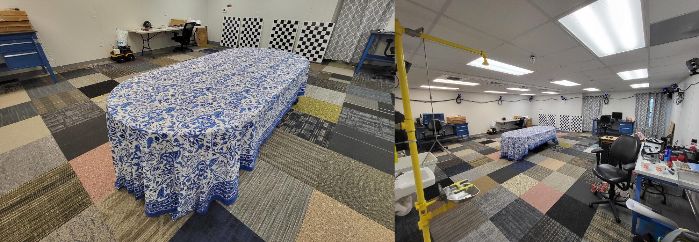

# Indoor AR Table Dataset

In this dataset we collected a series small-scale indoor table AR visual-inertial datasets ranging from 1-2 minutes in length.
A [Intel RealSense Depth Camera D455](https://www.intelrealsense.com/depth-camera-d455/) is equipped with groundtruth Optitrack markers and provides color monocular image at 30Hz and a 400Hz IMU inertial feed from its Bosch BMI055 IMU.
Additionally, the depth projected into the color image is also recorded (untested).
Groundtruth for the IMU of each platform is found through the [vicon2gt](https://github.com/rpng/vicon2gt) utility package developed by our group.

## Dataset Sequences

Each dataset has the system starting and ending at around the same location and starting from stationary.
The groundtruth for trajectory evaluation can be found in the [groundtruth/](groundtruth/) folder.

|        | Data | Length (m) | Video (x10) |
|:------:|:-------:|:-------:|:-----:|
| table1 | [rosbag]() | 0.0 | [link](ReadMe_Videos.md#table_01) |
| table2 | [rosbag]() | 0.0 | [link](ReadMe_Videos.md#table_02) |
| table3 | [rosbag]() | 0.0 | [link](ReadMe_Videos.md#table_03) |
| table4 | [rosbag]() | 0.0 | [link](ReadMe_Videos.md#table_04) |
| table5 | [rosbag]() | 0.0 | [link](ReadMe_Videos.md#table_05) |
| table6 | [rosbag]() | 0.0 | [link](ReadMe_Videos.md#table_06) |
| table7 | [rosbag]() | 0.0 | [link](ReadMe_Videos.md#table_07) |
| table8 | [rosbag]() | 0.0 | [link](ReadMe_Videos.md#table_08) |

## Calibration Sequences

A single dataset was used for both static and dynamic calibration of the sensors using [Kalibr](https://github.com/ethz-asl/kalibr) with the [april_6x6_80x80cm.yaml](https://drive.google.com/file/d/1MAU71K1xNAG8Kq-2Gl_f4rus2LYQ9z3r/view?usp=sharing) calibration board.
Additionally, a 20 hour static IMU dataset was recorded to recover the IMU intrinsic noise properties (random walk and biases).
The parameters were found using the [allan_variance_ros](https://github.com/ori-drs/allan_variance_ros) toolbox.
Result files can be found in the [calibration/](calibration/) folder.

|         | ROS Bag | Results |
|:-------:|:-------:|:-------:|
| color1 | [download](https://drive.google.com/file/d/1YR_7qZfSidkCXLZZjPTRSeD1KnCG-mKD/view?usp=sharing) | [imu-camchain](calibration/kalibr_color_0_imu/) |
| color2 | [download](https://drive.google.com/file/d/1DeeObZC4Y7IAGS6fMFoEiGriLVn5IME3/view?usp=sharing) | [imu-camchain](calibration/kalibr_color_1_imu/) |
| static  | [download](https://drive.google.com/file/d/15sQDbNIn7GCK6641gomuzFsAX3B0UpYu/view?usp=sharing) | [plots](calibration/imu/) |

